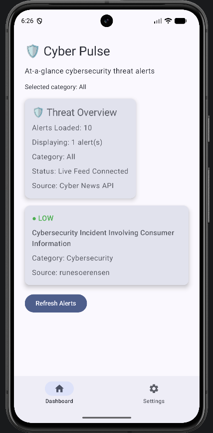
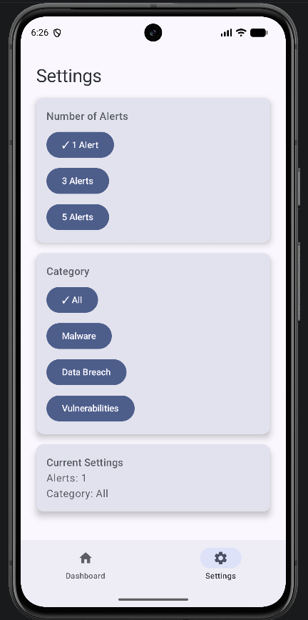

# Cyber Pulse

Cyber Pulse is a cybersecurity utility dashboard developed using Kotlin and Jetpack Compose. The application provides users with real-time cybersecurity news, threat information, and security alerts through a simple and intuitive interface.

## Features

* Live cybersecurity news feed
* Threat overview dashboard
* Automatic threat severity classification (High, Medium, Low)
* Alert filtering by category
* Adjustable number of displayed alerts
* Real-time data refresh
* Material Design 3 user interface
* Settings management

## Technologies Used

* Kotlin
* Jetpack Compose
* Material Design 3
* Android SDK
* ViewModel
* StateFlow
* Repository Pattern
* Retrofit
* Gson Converter

## Architecture

UI (Jetpack Compose)

↓

ViewModel

↓

Repository

↓

Retrofit

↓

Cyber News API

## Screens

### Dashboard

The dashboard displays live cybersecurity alerts, threat severity levels, and a threat overview summary. Users can quickly review the latest cybersecurity developments at a glance.

### Settings

The settings screen allows users to customise the number of alerts displayed and manage alert category preferences.

## Screenshots

### Dashboard

### Settings

## Key Functionality

### Threat Overview

* Displays the total number of alerts loaded
* Shows the currently selected category
* Indicates API connection status
* Provides an overview of current cybersecurity activity

### Alert Classification

Cyber Pulse automatically classifies alerts into:

* High Severity
* Medium Severity
* Low Severity

Classification is performed using cybersecurity-related keywords found within article titles.

### Real-Time News Feed

The application retrieves cybersecurity news articles through a remote API connection and updates the dashboard with the latest available information.

### Alert Filtering

Users can customise their dashboard experience by:

* Selecting the number of displayed alerts
* Filtering alerts by category
* Refreshing alerts on demand

## Future Improvements

* Dark Mode support
* Push notification alerts
* Additional cyber threat intelligence sources
* Bookmarking and saved alerts
* Search functionality
* Offline data caching

## Author

Swan Htet Zaw

James Cook University Singapore

CP3406 Mobile Technologies
